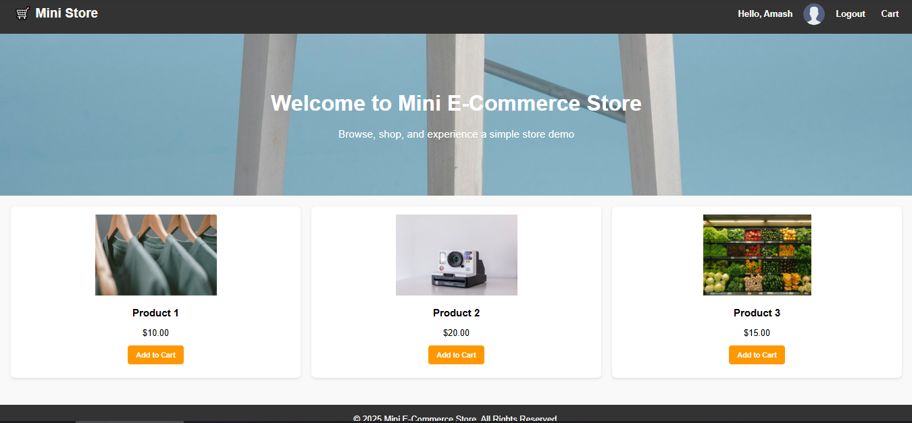

# 🛒 Mini E-Commerce Store

A simple front-end and back-end e-commerce demo application built with **HTML, CSS, JavaScript, Node.js, Express, and MySQL**.  

This project demonstrates user registration, login, dynamic navbar, and a basic product listing with a responsive design.

---

## 📸 Preview

  

---

## 💻 Features

- **User Registration & Login**  
  Users can register with a name and password. Login validates credentials from the MySQL database.  

- **Dynamic Navbar**  
  - Shows **Register/Login** if the user is not logged in  
  - Shows **Profile icon / Logout / Cart** if the user is logged in  

- **Product Listing**  
  - Three demo products displayed in a responsive grid  
  - Add to Cart button (non-functional in this demo)  

- **Responsive Design**  
  Works well on desktop and mobile devices.

---

## ⚙️ Tech Stack

- **Frontend:** HTML, CSS, JavaScript  
- **Backend:** Node.js, Express  
- **Database:** MySQL  
- **Other:** LocalStorage for session simulation, CORS for API handling

---

## 🗂️ Folder Structure

Mini-Ecommerce-Store/
│
├─ template/
│ ├─ register.html
│ ├─ login.html
│ └─ index.html
│
├─ server.js
└─ README.md


---

## 🚀 Getting Started

### Prerequisites

- Node.js installed  
- MySQL installed and running  

### Database Setup

1. Create a database:
```sql
CREATE DATABASE registerdb;
USE registerdb;
```

2. Create the users table:
```sql
CREATE TABLE users (
    id INT AUTO_INCREMENT PRIMARY KEY,
    name VARCHAR(255) NOT NULL UNIQUE,
    password VARCHAR(255) NOT NULL
);
```

Install Dependencies
-npm install express cors mysql2

Run the Server
-node server.js

### Open the App

-Serve your HTML files using Live Server in VSCode or any static server.
-Open index.html in your browser.
-Use /template/register.html to register a new user.
-Use /template/login.html to login.

📝 Notes

-The cart and profile pages are not fully functional in this demo.
-LocalStorage is used to simulate login sessions.


This project is open source and free to use.